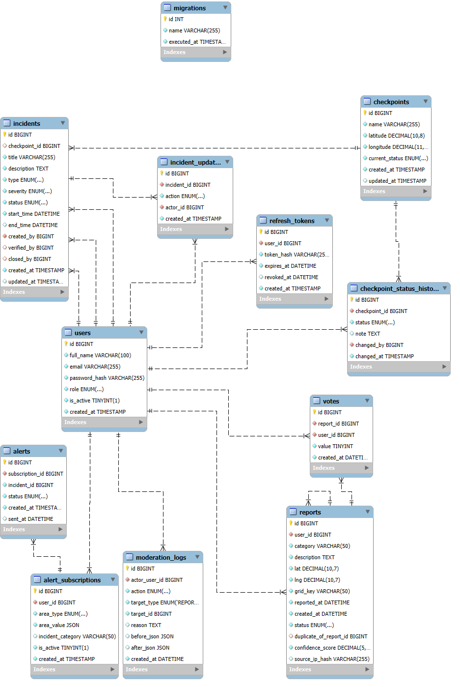

# Wasel Palestine Backend

Backend system for **Wasel Palestine** – Advanced Software Engineering Project.

This project provides a scalable and modular backend system for managing:

* Incidents & Checkpoints
* Crowdsourced Reports
* Route Estimation
* Alerts & Subscriptions
* Authentication & Authorization

The system is designed with real-world constraints in mind, focusing on scalability, performance, and maintainability.

---

# System Overview

Wasel Palestine is a backend system that enables users to:

* Report road incidents and conditions
* View checkpoint statuses
* Estimate routes dynamically
* Receive alerts based on preferences

User roles:

* **User** → submit reports & view data
* **Moderator/Admin** → verify incidents & manage system

---

# Architecture

The system follows a **layered modular architecture**:

```bash
Client → Routes → Controllers → Services → Repositories → Database
```

## Folder Structure

```bash
src/
  config/
  db/
  common/
  modules/
  integrations/
  scripts/
```

Each module contains:

* routes
* controller
* service
* repository

---

# Architecture Diagram

```text
Client
   ↓
Express Routes
   ↓
Controllers
   ↓
Services (Business Logic)
   ↓
Repositories (DB Access)
   ↓
MySQL Database
```

External integrations:

```text
Backend → Weather API / Routing API / Geocoding API
```

---

# Database Schema (ERD)



## Main Tables

* users
* reports
* votes
* incidents
* checkpoints
* checkpoint_status_history
* alerts
* alert_subscriptions
* refresh_tokens
* moderation_logs

## Key Relationships

* User → Reports (1:N)
* Reports → Votes (1:N)
* Checkpoints → Incidents (1:N)
* Users → Subscriptions (1:N)
* Incidents → Alerts (1:N)

---

# API Design Rationale

The API follows RESTful principles:

* Versioned endpoints:

  ```
  /api/v1/...
  ```

* Resource-based structure:

  * `/auth`
  * `/reports`
  * `/incidents`
  * `/checkpoints`
  * `/alerts`
  * `/routes`
  * `/integrations`

* Consistent responses:

  ```json
  {
    "success": true,
    "data": {},
    "message": "optional"
  }
  ```

* Pagination & filtering supported

---

# Authentication & Security

* JWT Authentication (Access + Refresh tokens)
* Role-Based Access Control (RBAC)
* Password hashing (bcrypt)
* Protected routes
* Rate limiting

---

# External API Integration

## Weather API

* Provides weather data
* Used for hazard detection

## Routing API

* Calculates optimal routes
* Supports avoiding checkpoints

## Geocoding API

* Convert addresses ↔ coordinates

---

# API Documentation

Swagger UI available at:

```
http://localhost:5000/api-docs
```

Includes:

* Endpoints
* Request/response schemas
* Authentication

---

# Postman Collection

The full API collection is available in:

```

docs/WaselPalestine API.openapi

```

## How to use

1. Open API Dog
2. Click **Import**
3. Select the file from `docs/WaselPalestine API.openapi`
4. Set base URL:

```
http://localhost:5000
```

5. Start testing endpoints

---

# Testing Strategy

## API Dog Testing

* Full API collection created
* Covers all modules

## Manual Testing

* Role-based access
* Invalid inputs
* Edge cases

---

# Performance Testing

Implemented:

* Database indexing
* Pagination
* Efficient queries
* Redis caching

Future work:

* Load testing (k6)
* Stress testing

---

# Docker Setup

Services:

* MySQL (3307)
* Redis (6379)
* Backend

Run:

```bash
docker compose up --build
```

---

# Getting Started

## Install

```bash
npm install
```

## Run locally

```bash
npm run dev
```

## Run migrations

```bash
npm run migrate:dev
```

---

# Environment Variables

See `.env.example`

---

# Engineering Practices

* Modular architecture
* Clean code
* Separation of concerns
* Dockerized services
* Scalable design

---

# Contributors

* Shahd Alawneh
* Yasmeen Khaleel
* Sewar Diab
* Loay Suwwan

---

# License

Academic project for Advanced Software Engineering course.
